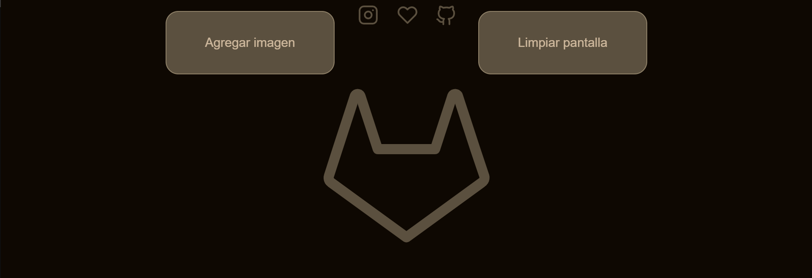

    

        </img>
    

 # RandomFox con Lazy Loading

Este es un proyecto que utiliza la API RandomFox para mostrar imágenes aleatorias de zorros en una página web. Las cuáles se muestran y se borran de pantalla por medio de un botones.

 Para mejorar la velocidad de carga de la página, se ha implementado la técnica de lazy loading en las imágenes.
 De esta manera, se retrasa la carga de las imágenes hasta que el usuario las necesita o las solicita explícitamente, lo que mejora significativamente el tiempo de carga de la página.

Además, se utilizó HTML, CSS y JavaScript para diseñar y desarrollar la página web.

-----
## vista previa

    

        </img>
    

vista del proyecto https://ferelias.github.io/lazy-loanding/
